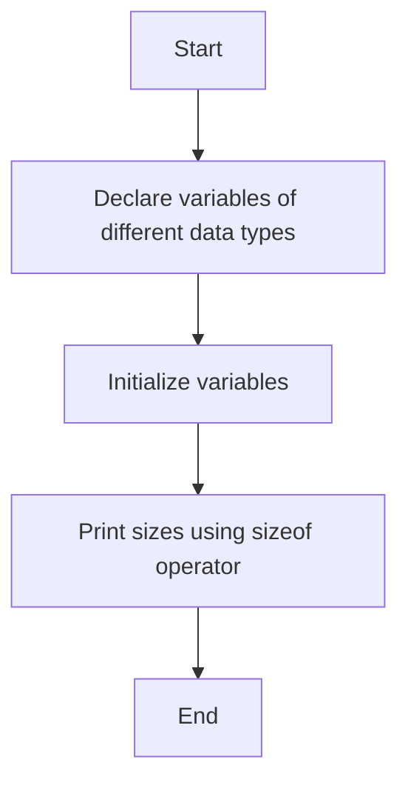

## Write a C Program to Declare and Initialize Variables of Different Data Types and Display Their Sizes

### Aim

To write a C program that declares and initializes variables of various data types and displays their sizes using the `sizeof` operator.

### Example Problem

**Problem Statement:** Declare and initialize variables of data types such as `int`, `float`, `char`, and `double`, and display their sizes using the `sizeof` operator.

#### Algorithm

1.  Start the program.
    
2.  Declare variables of different data types (`int`, `float`, `char`, `double`).
    
3.  Initialize the variables with appropriate values.
    
4.  Use the `sizeof` operator to determine and print the sizes of each variable.
    
5.  End the program.
    

#### Flowchart



#### Hint Code Snippet

-   Declare variables of different data types (`int a`, `float b`, `char c`, `double d`).
    
-   Use the `sizeof` operator to determine the size of each variable.
    
    ```
    int a = 10;
    float b = 5.5;
    char c = 'A';
    double d = 15.1234;
    printf("Size of int: %d bytes\n", sizeof(a));
    printf("Size of float: %d bytes\n", sizeof(b));
    printf("Size of char: %d bytes\n", sizeof(c));
    printf("Size of double: %d bytes\n", sizeof(d));
    ```
    
-   **Hint:** Observe how different data types have different sizes. What might cause these differences?
    
-   **Explanation:** The `sizeof` operator is used to determine the memory occupied by each variable. Sizes may vary depending on the data type and the system architecture.
    

#### Suggested Programs

1.  Write a program to declare and initialize an array of integers and print its size.
    
2.  Write a program to declare variables of different data types (`short`, `long`, `long long`) and display their sizes.
    
3.  Write a program to declare a structure with multiple data types and determine the total size of the structure.
<!--stackedit_data:
eyJoaXN0b3J5IjpbLTIxMTc2MDAzMzVdfQ==
-->