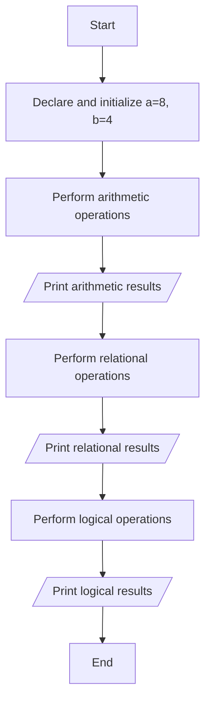

## Implement Arithmetic, Relational, and Logical Operations in C Programs and Display the Results

### Aim

To write a C program that demonstrates the use of arithmetic, relational, and logical operators and prints the results of the operations.

### Example Problem

**Problem Statement:** Given two integer variables, perform arithmetic operations (addition, subtraction, multiplication, division), relational operations (greater than, less than), and logical operations (AND, OR) and display the results.

#### Algorithm

1.  Start the program.
    
2.  Declare two integer variables `a` and `b` and initialize them.
    
3.  Perform arithmetic operations (`+`, `-`, `*`, `/`) and print the results.
    
4.  Perform relational operations (`>`, `<`) and print the results.
    
5.  Perform logical operations (`&&`, `||`) and print the results.
    
6.  End the program.
    

#### Flowchart



#### Hint Code Snippet

-   Declare `int a = 8, b = 4`.
    
-   Perform arithmetic operations (`+`, `-`, `*`, `/`, `%`).
    
    ```
    int a, b;
    
    // Take a and b as inputs from user
    printf("Enter a: ");
    scanf("%d", &a);
    printf("Enter b: ");
    scanf("%d", &b);
    
    printf("a + b = %d\n", a + b);  // Addition
    printf("a - b = %d\n", a - b);  // Subtraction
    printf("a * b = %d\n", a * b);  // Multiplication
    printf("a / b = %d\n", a / b);  // Division
    printf("a % b = %d\n", a % b);  // Modular division
    ```
    
-   Perform relational operations (`>`, `<`, `>=`, `<=`, `==`, `!=`).
    
    ```
    printf("a > b = %d\n", a > b); // Greater than operator
    printf("a < b = %d\n", a < b); // Less than operator
    printf("a >= b = %d\n", a >= b); // Greater than or equal to operator
    printf("a <= b = %d\n", a <= b); // Less than or equal to operator
    printf("a == b = %d\n", a == b); // Equal to operator
    printf("a != b = %d\n", a != b); // Not equal to operator
    ```
    
-   Perform logical operations (AND (`&&`), OR (`||`), NOT (`!`)).
    
    ```
    printf("(a > b) && (b > 0) = %d\n", (a > b) && (b > 0)); // Logical AND
    printf("(a < b) || (b > 0) = %d\n", (a < b) || (b > 0)); // Logical OR
    printf("!(a < b) = %d\n", !(a < b) ); // Logical OR
    ```
    
-   **Hint:** Think about how relational and logical operators produce boolean results (`0` for false, `1` for true).
    
-   **Explanation:** Arithmetic operations are straightforward calculations. Relational operations compare two values, while logical operations combine boolean conditions.
    

#### Suggested Programs

1.  If a five-digit number is input through the keyboard, write a program to calcluate 
    
2.  Write a program to evaluate complex logical expressions involving three variables.
    
3.  Write a program to compare three numbers using relational operators and determine the largest.
<!--stackedit_data:
eyJoaXN0b3J5IjpbMjA0MzQ2MzUxNSwtMTg5MjM1NTEwMF19
-->