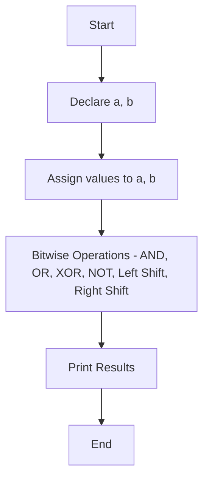

## Write a C Program to Perform Bitwise Operations on Integer Variables and Print the Results

### Aim

To write a C program that demonstrates the use of bitwise operators (AND, OR, XOR, NOT, left shift, and right shift) with integer variables and prints the results.

### Example Problem

**Problem Statement:** Given two integer variables, perform bitwise AND, OR, XOR, NOT, left shift, and right shift operations and display the results.

#### Algorithm

1.  Start the program.
    
2.  Declare two integer variables `a` and `b`.
    
3.  Assign values to `a` and `b`.
    
4.  Perform bitwise AND, OR, XOR, NOT, left shift, and right shift operations on `a` and `b`.
    
5.  Print the results of each operation.
    
6.  End the program.
    

#### Flowchart



    

#### Hint Code Snippet

-   Declare `int a` and `b` and assign values.
    
-   Perform bitwise operations `&`, `|`, `^`, `~`, `<<`, and `>>`.
    
    ```c
    int a = 5, b = 3;
    printf("a & b = %d\n", a & b);
    printf("a | b = %d\n", a | b);
    printf("a ^ b = %d\n", a ^ b);
    printf("~a = %d\n", ~a);
    printf("a << 1 = %d\n", a << 1);
    printf("b >> 1 = %d\n", b >> 1);
    ```
    
-   **Hint:** Observe how binary representation of `a` and `b` affects the result of each operation.
    
-   **Explanation:** Bitwise AND (`&`) results in bits that are `1` only if both corresponding bits are `1`. Bitwise OR (`|`) results in bits that are `1` if either bit is `1`. Bitwise NOT (`~`) inverts all bits. Left shift (`<<`) shifts the bits to the left, adding zeros on the right, while right shift (`>>`) shifts bits to the right, discarding bits on the right.
    

#### Suggested Programs

1.  Write a program to swap two integer variables using XOR without using a temporary variable.
    
2.  Write a program to determine whether a number is a power of 2 using bitwise operations.
    
3.  Write a program to count the number of set bits (1s) in an integer.
<!--stackedit_data:
eyJoaXN0b3J5IjpbLTQyOTEwMjUwOF19
-->