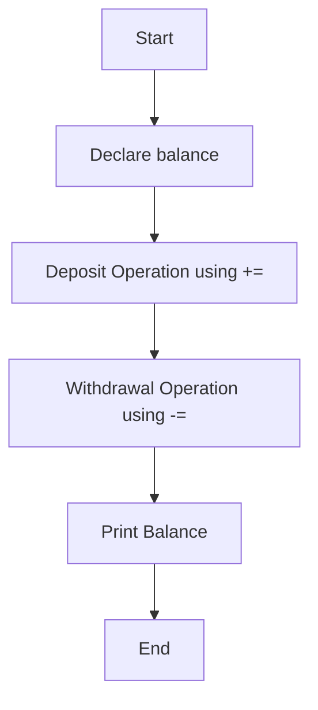

## Write a C Program to Demonstrate the Use of Assignment Operators and Evaluate Expressions Involving Them

### Aim

To write a C program that uses different assignment operators to evaluate expressions and demonstrate their use in calculations.

### Example Problem

**Problem Statement:** Calculate the final amount in a bank account after performing a series of deposits and withdrawals using assignment operators.

#### Algorithm

1.  Start the program.
    
2.  Declare a variable `balance` and initialize it with an initial value.
    
3.  Perform a deposit operation using `+=`.
    
4.  Perform a withdrawal operation using `-=`.
    
5.  Print the final balance.
    
6.  End the program.
    

#### Flowchart



#### Hint Code Snippet

-   Declare `int balance = 1000`.
    
-   Use `+=` and `-=` to modify `balance`.
    
    ```
    int balance = 1000;
    balance += 500; // deposit
    balance -= 200; // withdrawal
    printf("Final balance: %d\n", balance);
    ```
    
-   **Hint:** What would happen if you changed the order of deposit and withdrawal? Try different initial values for `balance`.
    
-   **Explanation:** Assignment operators like `+=` and `-=` modify the value of a variable in place, making code more concise.
    

#### Suggested Programs

1.  Write a program to demonstrate the use of `*=` to calculate the power of a number.
    
2.  Write a program to update the value of a variable using different arithmetic operations (`+=`, `-=`, `*=`, `/=`).
    
3.  Write a program to calculate the average of numbers using assignment operators.
<!--stackedit_data:
eyJoaXN0b3J5IjpbLTIxMDIzOTYxMDddfQ==
-->