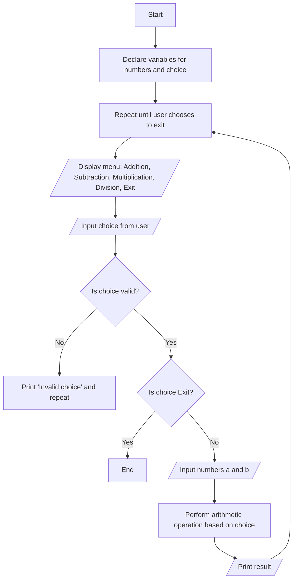

## Write a C Program to Implement Various Control Flow Statements

### Aim
To write a C program that demonstrates the use of if-else, switch-case, and loop control flow to solve a real-world problem.

### Example Problem
**Problem Statement:** Write a program that takes user input to select an arithmetic operation (addition, subtraction, multiplication, or division) and applies the operation to two input numbers using if-else, switch-case, and loop control flows.

#### Algorithm
1. Start the program.
2. Declare variables for two numbers a and b and the user's choice.
3. Use a menu-driven approach with a loop to display options for arithmetic operations.
4. Take user input for the choice and validate it.
5. Based on the choice, use if-else or switch-case to perform the selected arithmetic operation.
6. Print the result and ask if the user wants to perform another calculation.
7. Repeat from step 3 when the user enters a valid choice.
8. End the program when the user chooses to exit.

#### Flowchart

- **Details:** This flowchart represents the program flow where the user is repeatedly asked to select an arithmetic operation until they choose to exit.

#### Hint Code Snippet
- Use a loop to display the menu.
- Take the user's choice and apply an if-else or switch-case to perform the corresponding operation.
  ```c
  int choice, a, b;
  do {
      printf("\nMenu:\n1. Addition\n2. Subtraction\n3. Multiplication\n4. Division\n5. Exit\nEnter your choice: ");
      scanf("%d", &choice);
      if (choice >= 1 && choice <= 4) {
          printf("Enter two numbers: ");
          scanf("%d %d", &a, &b);
      }
      switch (choice) {
          case 1: printf("Result: %d\n", a + b); break;
          case 2: printf("Result: %d\n", a - b); break;
          case 3: printf("Result: %d\n", a * b); break;
          case 4: if (b != 0) printf("Result: %d\n", a / b); else printf("Division by zero error\n"); break;
          case 5: printf("Exiting...\n"); break;
          default: printf("Invalid choice. Try again.\n");
      }
  } while (choice != 5);
  ```
- **Hint:** Validate the user's input to handle invalid choices effectively.

#### Suggested Programs
1. Write a program to calculate the power of a number using a loop and if-else control flow.
2. Write a menu-driven program to take a point (x, y) as input from the user and print if it lies on X-axis, Y-axis or origin.
3. Write a menu-driven program to take the lengths of the sides of a triangle as input from the user and print the type of the triangle.


<!--stackedit_data:
eyJoaXN0b3J5IjpbNTg3MTgzNzE4XX0=
-->