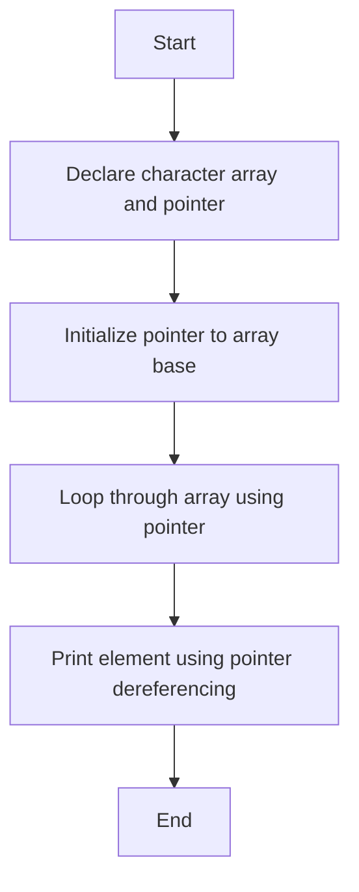
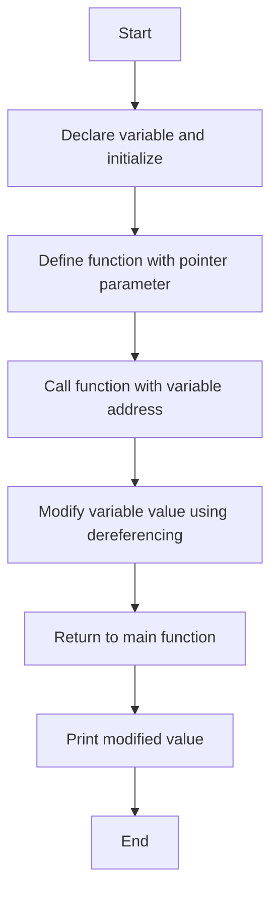

# Demonstrating the Use of Pointers and Structures in C

## Objective: Write C Programs to Demonstrate the Use of Pointers and Structures in C

### Aim

To understand and implement the use of pointers and structures in C programming, enabling efficient memory manipulation and handling of complex data types.

### Example Problems

#### Example 1: Pointer Arithmetic

**Problem Statement:** Write a program to demonstrate pointer arithmetic by iterating through a character array and printing its elements using pointer notation.

**Algorithm:**

1.  Start the program.
2.  Declare a character array and initialize it with some values.
3.  Declare a pointer variable and point it to the base address of the array.
4.  Use a loop to traverse the array using the pointer.
5.  Print each element of the array by dereferencing the pointer.
6.  End the program.

**Flowchart:**

#### Example 2: Call by Reference

**Problem Statement:** Write a program to demonstrate the concept of call by reference by passing a variable's address to a function and modifying its value.

**Algorithm:**

1.  Start the program.
2.  Declare an integer variable and initialize it with a value.
3.  Define a function that accepts a pointer to an integer as a parameter.
4.  Inside the function, modify the value of the variable using dereferencing.
5.  Call the function by passing the address of the variable.
6.  Print the modified value of the variable.
7.  End the program.

**Flowchart:**

----------

### Suggested Programs

#### **Program 1: Accessing Elements of an Array Using Pointers**

**Problem Statement:** Write a program to demonstrate the use of pointers to access elements of an array.

----------

#### **Program 2: Swapping Two Numbers Using Pointers**

**Problem Statement:** Develop a C program to swap two numbers using pointers.

<!--stackedit_data:
eyJoaXN0b3J5IjpbLTE1NzkwNjc3MzZdfQ==
-->