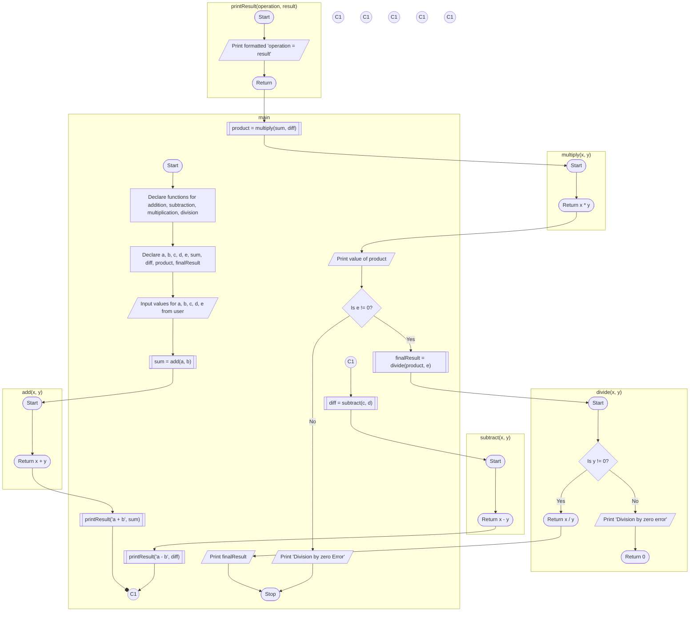

## Write C programs to demonstrate the use of functions in C.

### Aim
To write C programs to demonstrate the use of functions in C.

### Example Problem
**Problem Statement:** Write functions for addition, subtraction, multiplication, division, and a user-defined function to print the results in a specific format. Use these functions to solve the expression `((a + b) * (c - d)) / e`, where `a`, `b`, `c`, `d`, and `e` are provided by the user. Display each intermediate step in a specific format using the user-defined print function.

### Algorithm
1. Start the program.
2. Declare functions for addition, subtraction, multiplication, and division.
3. In the main function, take input for `a`, `b`, `c`, `d`, and `e` from the user.
4. Call the functions to solve `a + b`, `c - d`, and `(a + b) * (c - d)`.
5. Use the division function to calculate the final result by dividing the intermediate product by `e`.
6. Print each intermediate result and the final result in a formatted manner.
7. End the program.

### Flowchart

- **Details:** The flowchart illustrates the steps of calculating intermediate results using individual arithmetic functions and printing the final result.

### Hint Code Snippet
- Declare functions for each arithmetic operation.
- Call these functions in the main program to solve the expression.

```c
// Function definitions
void printResult(char* operation, int result) {
    printf("%s = %d\n", operation, result);
}

int add(int x, int y) {
    return x + y;
}

int subtract(int x, int y) {
    return x - y;
}

int multiply(int x, int y) {
    return x * y;
}

int divide(int x, int y) {
    if (y != 0) return x / y;
    else {
        printf("Division by zero error\n");
        return 0;
    }
}

int main() {
    int a, b, c, d, e;
    printf("Enter values for a, b, c, d, e: ");
    scanf("%d %d %d %d %d", &a, &b, &c, &d, &e);

    int sum = add(a, b);
    printResult("a + b", sum);

    int diff = subtract(c, d);
    printResult("c - d", diff);

    int product = multiply(sum, diff);
    printResult("(a + b) * (c - d)", product);

    if (e != 0) {
        int finalResult = divide(product, e);
        printResult("((a + b) * (c - d)) / e", finalResult);
    } else {
        printf("Division by zero error\n");
    }

    return 0;
}
```

- **Hint:** Make sure to handle the division by zero case in the division function.

### Suggested Programs (2 of 5)
1. Create a function in C to calculate the factorial of a given number and display the result. (Mandatory)
2. Write a program to create functions for calculating the power of a number using a loop.
3. Write a function to find the maximum and minimum of three given numbers.
5. Write a function to calculate the sum of an array of numbers and display the average.

<!--stackedit_data:
eyJoaXN0b3J5IjpbNzA4MjQzMDkzLC0xMjkzNzAyMTIwXX0=
-->