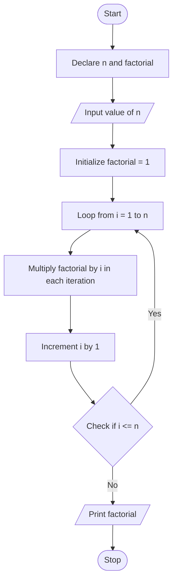
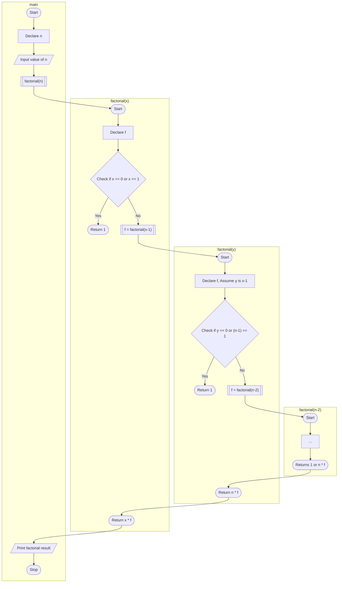

## Write C programs to understand the concept of recursion

### Aim
To write C programs to understand the concept of recursion.

### Example Problem
**Problem Statement:** Find the factorial of a number using a loop (without recursion) and using recursion.

### Iterative Approach
#### Algorithm
1. Start the program.
2. Declare a variable `n` to store the number, and a variable `factorial` initialized to 1.
3. Take user input for `n`.
4. Use a loop from 1 to `n` and multiply each value with `factorial`.
5. Print the result.
6. End the program.

#### Flowchart

- **Details:** The flowchart illustrates an iterative approach to calculate the factorial, which uses a loop structure for repeated multiplication.

### Recursive Approach
#### Algorithm
1. Start the program.
2. Create a recursive function `factorial(int n)` that returns the factorial of `n`.
   - Base case: If `n` is 0 or 1, return 1.
   - Recursive step: Return `n * factorial(n - 1)`.
3. In the main function, take user input for `n` and call the `factorial` function.
4. Print the result.
5. End the program.

#### Flowchart

- **Details:** The flowchart represents the recursive calculation of factorial, with a base case to stop the recursion and recursive calls to solve the problem.

### Code
#### Iterative Version
```c
#include <stdio.h>

int main() {
    int n, factorial = 1;
    printf("Enter a number: ");
    scanf("%d", &n);

    for (int i = 1; i <= n; i++) {
        factorial *= i;
        printf("Loop iteration %d: factorial=%d\n", i, factorial);
    }

    printf("Factorial of %d is %d\n", n, factorial);
    return 0;
}
```
#### Recursive Version
```c
#include <stdio.h>

int factorial(int n) {
    int f;
    if (n == 0 || n == 1) {
        return 1;
    }
    printf("n : %d\n", n);
    f = factorial(n - 1);
    printf("factorial(n-1) : %d\n", f);
    return n * f;
}

int main() {
    int n;
    printf("Enter a number: ");
    scanf("%d", &n);

    printf("Factorial of %d is %d\n", n, factorial(n));
    return 0;
}
```
- **Hint:** Recursion is often more readable but may be less efficient than iteration for large inputs due to function call overhead and risk of stack overflow.

### Suggested Programs (any 1)
1. **Print the Fibonacci series using loop (without recursion) and with recursion.**
   - Fibonacci series: 1, 1, 2, 3, 5, 8, 13, 21, 34, ...
   - This series has its first two numbers as 1 and every other number is the sum of the previous two numbers. 
   - `fib(n) = fib(n-1) + fib(n-2)`

2. **Write a program to find the sum of digits of a number using recursion.**
   - To find the sum of digits recursively, use `n % 10` to get the last digit and `n / 10` to reduce the number. Repeat until `n` becomes 0. Think of the anchor condition in the case of recursion.

3. **Find the GCD of two integers using the Euclidean algorithm, which involves recursive division.**
   - The GCD can be found using recursion where `gcd(a, b)` is calculated by calling `gcd(b, a % b)` until `b` becomes 0.
   - Example: 

4. **Reverse a given string by recursively reversing its substrings.**
   - Use two pointers to swap the first and last characters of the string, and then call the function recursively on the substring.

5. **Determine if a string is a palindrome by comparing characters recursively from the start and end towards the center.**
   - Compare the first and last characters of the string. If they are equal, call the function recursively on the remaining substring.
<!--stackedit_data:
eyJoaXN0b3J5IjpbMTY1MzYxMDU1MSwtMTQwMjMxODEyM119
-->